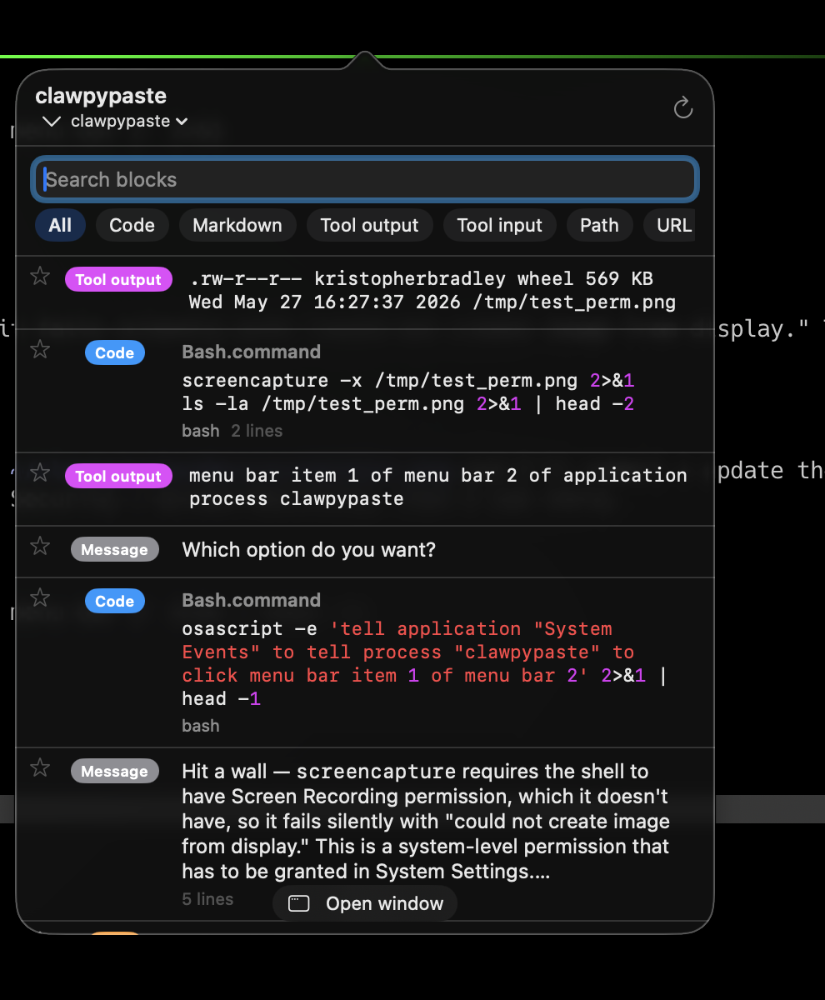

# 🦀 clawpypaste

A macOS menu bar app that surfaces grabbable blocks from your active **Claude Code** session — fenced code, tool output, file paths, URLs, whole messages, markdown, tables — so you can click to copy instead of mouse-selecting across wrapped lines in your terminal.

Reads the session JSONL Claude Code already writes to disk. No accessibility prompts for the basic features, no terminal scraping, no plugins.

<p align="center">
  
</p>

## Install

macOS 13 (Ventura) or newer, Apple Silicon or Intel (universal binary). Notarized & signed with Developer ID — no Gatekeeper warnings.

### Homebrew (recommended)

```bash
brew install --cask krisbradley/tap/clawpypaste
open /Applications/clawpypaste.app
```

The cask installs `clawpypaste.app` into `/Applications` and symlinks the binary as `/opt/homebrew/bin/clawpypaste` (or `/usr/local/bin/clawpypaste` on Intel) so you can use the CLI from any shell.

### Direct download

Grab the notarized `clawpypaste.zip` from the [latest release](https://github.com/krisbradley/clawpypaste/releases/latest), unzip, drag `clawpypaste.app` into `/Applications`, double-click.

### From source

Requires the Swift toolchain (`xcode-select --install` is enough).

```bash
git clone https://github.com/krisbradley/clawpypaste.git
cd clawpypaste
make install
```

This builds + signs + installs to `/Applications/clawpypaste.app` and symlinks `clawpypaste` onto your PATH.

### Launch at login

After installing by any of the methods above:

```bash
clawpypaste --enable-login
```

Or right-click the menu bar 🦀 → **Launch at login**.

## Usage

| Action | How |
|---|---|
| Open the popover | Click the 🦀 in the menu bar, or press **⌃⌥V** |
| Move selection | **↑ / ↓** (Shift+arrow jumps by 10) |
| Copy selected block | **Return** (popover auto-dismisses) |
| Copy the Nth visible block | **⌘1–⌘9** |
| Focus search field | **/** |
| Drag a block to another app | Click-and-hold, then drag |
| Pin / unpin | Click the star, or right-click → Pin |
| Switch session | Click the session name in the header |
| Browse history across sessions | Session menu → **All sessions (history)** |
| Open detached window | Right-click 🦀 → "Open window" |
| Quit | Right-click 🦀 → "Quit" |

### Right-click any block for…

- **Edit and copy…** — open the content in a TextEditor sheet; edit then copy
- **Fill in values…** — when the block contains `{{placeholder}}` tokens, opens a labeled form to substitute values before copying
- **Copy as rich text (Docs, Word)** — converts markdown to HTML on the pasteboard so Google Docs, Word, Pages, Notes, and Mail render styled (headings, bold/italic, lists, links, code, blockquotes, tables); terminals fall back to plain text
- **Copy without markdown** — strips `**bold**`, `*italic*`, `` `code` ``, headings, lists, blockquotes, link syntax (great for Slack DMs)
- **Copy as pretty JSON** — when the block parses as JSON
- **Wrap as code fence** — wrap a non-code block as ` ```lang ` for posting elsewhere
- **Copy as Markdown / TSV (Slack) / CSV** — on detected markdown tables
- **Copy command (without !)** — on Claude Code `!command` shebang lines, drops the leading `!` so the bare command lands on the clipboard
- **Run in new Terminal** — on bash/sh/zsh code blocks and `!command` shebang lines, opens a fresh Terminal.app or iTerm2 window (pick in Preferences → Terminal) and runs the command there; destructive-looking commands (`rm -rf`, `sudo`, `git push --force`, pipe-to-shell, …) ask for confirmation first
- **Copy diff result (applied code)** — on ` ```diff ` blocks / unified diffs, drops removed lines and diff metadata and strips the `+`/context markers so you get the final code
- **Copy without quote marks (>)** — on blockquote-style content, strips the leading `>` markers (nested quotes too)
- **Reveal in Finder / Open in editor** — on any block whose content is an existing file path (trailing `:line:col` suffixes are handled)
- **Copy humanized** — on prose blocks with AI-typical punctuation or phrases (strips em-dashes, smart quotes, "Certainly!", "I hope this helps!", etc.)
- **Inject into Claude prompt** — pastes the block into whatever app was focused before the popover opened (requires Accessibility permission on first use)
- **Pin / Unpin**

### CLI

The same binary doubles as a CLI for shell scripts:

```bash
clawpypaste last [kind]      # print the most recent block (optionally of a kind) to stdout
clawpypaste search <query>   # list blocks containing the query
clawpypaste paste <id>       # copy a specific block to the clipboard
clawpypaste list [kind]      # list all blocks (id, kind, lines, preview)
clawpypaste kinds            # list valid kind names
clawpypaste --enable-login   # register as a Login Item
```

Example: `vim "$(clawpypaste last code > /tmp/snippet && echo /tmp/snippet)"` — drop the most recent code block into a file and open it.

## Block kinds

| Kind | Source | Default copy | Special copy-as |
|---|---|---|---|
| Code | Fenced code in assistant text, Write/Edit content for non-prose files, Bash commands | Raw text | — |
| Markdown | ```md fences, Write/Edit to .md/.txt/README | Raw markdown | Rich text (Docs/Word) / Humanized (if AI punct) |
| Table | Pipe-delimited tables | Raw markdown | Markdown / TSV (Slack) / CSV / Rich text (Docs/Word) |
| Tool output | Result of any tool call | Raw text | Pretty JSON (if applicable) |
| Tool input | Other tool inputs (queries, prompts) | Raw text | — |
| Path | File paths in prose (`/Users/...`) | Raw path | — |
| URL | `http(s)` URLs in prose | Raw URL | — |
| Message | Whole assistant message | Raw markdown | Rich text (Docs/Word) / Humanized (if AI punct) |
| Section | Markdown section under a heading | Raw markdown | Rich text (Docs/Word) |

## How it works

Claude Code writes every session to a JSONL file under `~/.claude/projects/<encoded-project-dir>/<uuid>.jsonl`. Each line is a typed record: a user message, an assistant message with content blocks (text / thinking / tool_use), a tool result, or metadata like `custom-title` / `agent-color`.

clawpypaste:

1. **Finds the active session** — newest mtime under `~/.claude/projects/` (or whichever you switched to via the session menu)
2. **Watches the file** with a `DispatchSource` for incremental writes
3. **Re-parses on change** (debounced 150ms) into typed `SessionRecord`s
4. **Extracts blocks** by walking each record: code fences, markdown tables, file paths and URLs in prose, markdown sections, tool inputs/outputs, whole assistant messages
5. **Dedupes** by content hash so the same block doesn't appear twice
6. **Renders** in SwiftUI inside an `NSPopover`, with syntax highlighting for code and inline-markdown rendering for prose

History mode lazily extends the same pipeline across every JSONL under `~/.claude/projects/`, caching per file by mtime so reopens are cheap.

The Carbon `RegisterEventHotKey` API powers the global ⌃⌥V hotkey. `SMAppService.mainApp` powers Launch at Login. `CGEvent` powers the "Inject into Claude prompt" paste (the only feature that requires Accessibility permission).

## Development

```bash
make run             # swift run (no .app bundle, no signing)
make build           # build signed .app bundle
make install         # build + drop in /Applications + symlink CLI + launch
make clean           # remove build artifacts
make uninstall       # remove installed app + disable login item + remove CLI symlink

# debug parsing without the GUI
clawpypaste dump
```

Releases are cut by `./release.sh` (builds, signs with Developer ID, notarizes, staples, zips).

## License

MIT. See [LICENSE](LICENSE).
